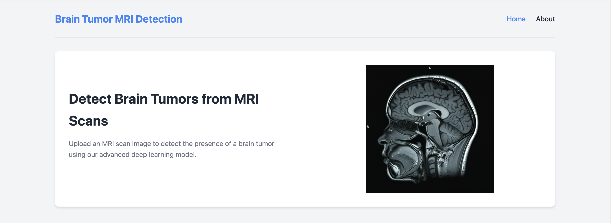
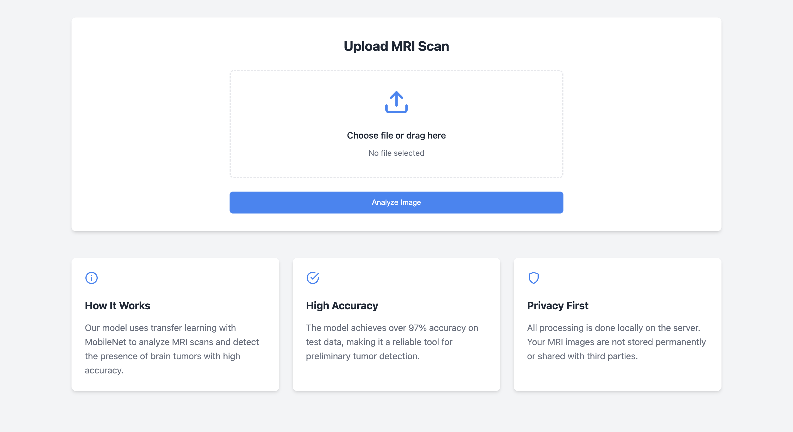
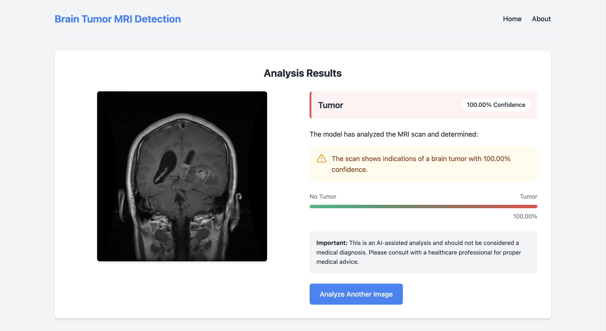

### Brain Tumor MRI Detection



A Flask-based web application that uses deep learning with transfer learning (MobileNet) to detect brain tumors from MRI scans with high accuracy.

## Features

- **User-friendly Interface**: Simple drag-and-drop or file selection for MRI scan uploads
- **Real-time Analysis**: Instant processing and results display
- **High Accuracy**: Achieves over 97% accuracy on test data
- **Visual Results**: Clear visualization of detection results with confidence scores
- **Privacy-focused**: All processing is done locally on the server with no permanent storage of uploaded images
- **Responsive Design**: Works seamlessly on both desktop and mobile devices


## Screenshots

### Upload Interface



### Results - Tumor Detected



### Results - No Tumor Detected


## Technology Stack

- **Backend**: Flask (Python)
- **Deep Learning**: TensorFlow/Keras with MobileNet architecture
- **Frontend**: HTML, CSS, JavaScript
- **Model**: Transfer learning with MobileNet (97.32% accuracy)


## Model Development Journey

The project evolved through multiple iterations to achieve the current high accuracy:

### Initial Approach: Custom CNN

I first developed a custom Convolutional Neural Network (CNN) architecture trained from scratch:

- **Architecture**: Multiple convolutional layers with max pooling, dropout, and dense layers
- **Parameters**: ~5.6 million trainable parameters (21.51 MB)
- **Training**: 26 epochs (with early stopping)
- **Accuracy**: 94.80% on test data


While this model performed reasonably well, it had several limitations:

- Slower convergence (required more epochs)
- Larger model size
- Slightly lower accuracy
- Higher risk of overfitting due to the large number of parameters


### Improved Approach: Transfer Learning with MobileNet

To address these limitations, I implemented a transfer learning approach using MobileNet:

- **Architecture**: Pre-trained MobileNet base with a custom classification head
- **Parameters**: Only 50,177 trainable parameters (196 KB) - over 100x reduction!
- **Training**: Only 5 epochs to reach optimal performance
- **Accuracy**: 97.32% on test data - a significant improvement


The transfer learning approach provided several advantages:

- **Higher accuracy**: 2.52% improvement over the custom CNN
- **Faster convergence**: Reached optimal performance in 1/5 the number of epochs
- **Smaller model size**: 100x reduction in trainable parameters
- **Better generalization**: Pre-trained weights helped the model generalize better to medical images


This development journey demonstrates the power of transfer learning for specialized image classification tasks, even with limited domain-specific data.

## Installation and Setup

### Prerequisites

- Python 3.8 or higher
- pip package manager


### Installation Steps

1. Clone the repository

```shellscript
git clone https://github.com/yourusername/brain-tumor-detection.git
cd brain-tumor-detection
```


2. Create and activate a virtual environment (recommended)

```shellscript
python -m venv venv
source venv/bin/activate  # On Windows: venv\Scripts\activate
```


3. Install the required dependencies

```shellscript
pip install -r requirements.txt
```


4. Place your trained model file in the root directory

1. The application expects a file named `bestmodel.h5`
2. If you don't have a trained model, you can use our pre-trained model (see below)


5. Run the application

```shellscript
python app.py
```


6. Open your browser and navigate to `http://127.0.0.1:5000`


## Model Information

The application uses a transfer learning approach with MobileNet as the base model:

- **Architecture**: MobileNet with custom classification head
- **Training**: Transfer learning on brain MRI dataset
- **Accuracy**: 97.32% on test data
- **Input Size**: 224x224 RGB images
- **Classes**: Binary classification (Tumor/No Tumor)


## Handling Model Compatibility Issues

If you encounter errors loading the model (particularly related to TensorFlow version compatibility), the application includes a fallback mechanism that:

1. Attempts to load the model directly
2. If that fails, recreates the model architecture and loads just the weights
3. Provides helpful error messages if both approaches fail


Common solutions for compatibility issues:

- Use the same TensorFlow version that was used to train the model
- Retrain the model with your current TensorFlow version
- Convert the model to TensorFlow Lite or SavedModel format


## Usage

1. Navigate to the home page
2. Upload an MRI scan image (JPG, JPEG, or PNG format)
3. Click "Analyze Image"
4. View the results with confidence score and prediction


## Security Considerations

- The application uses a secret key for session management. For production, replace the default key in `app.py` with a secure random key.
- Consider implementing HTTPS for secure data transmission in production.
- The application does not store uploaded images permanently, but temporary files are created during processing.


## Future Improvements

- Add user authentication to track analysis history
- Implement Grad-CAM visualization to highlight areas of interest in the MRI
- Add batch processing for multiple images
- Deploy as a Docker container for easier setup
- Implement a more detailed analysis with tumor type classification


## Disclaimer

This application is for educational and research purposes only. It should not be used for medical diagnosis. Always consult with a healthcare professional for proper medical advice.

## License

This project is licensed under the MIT License - see the LICENSE file for details.

## Acknowledgments

- The MobileNet model architecture from TensorFlow/Keras
- The brain tumor MRI dataset used for training
- Flask and its community for the excellent web framework